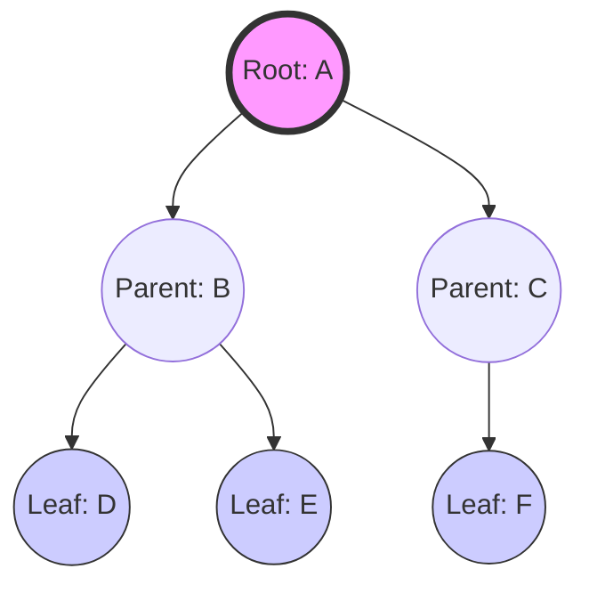

# Q: explain Tree In DSA

# Comprehensive Guide to Tree Data Structures

# 1. Introduction to Trees

In the world of Data Structures and Algorithms (DSA), most structures we encounter are **linear**, such as Arrays, Linked Lists, Stacks, and Queues. However, real-world data is often hierarchical rather than linear. For example, a file system on your computer, a family tree, or the organizational structure of a company are all hierarchical.

To represent this, we use a **Tree** data structure.

## 1.1 What is a Tree?

A tree is a non-linear, hierarchical data structure consisting of nodes connected by edges. Unlike arrays or linked lists, which have a sequential relationship, a tree represents a parent-child relationship.

> **Definition:** A Tree is a collection of nodes where each node contains a value (data) and a set of pointers (links) to other nodes. It is an acyclic connected graph.

## 1.2 Essential Terminology

To master trees, you must first speak the language. Below are the fundamental terms used to describe tree components:

*   **Node:** The fundamental unit of a tree containing data and links to other nodes.
*   **Root:** The topmost node of the tree. It is the only node that has no parent.
*   **Edge:** The link or path between two nodes.
*   **Parent:** A node that has a branch leading to another node (its child).
*   **Child:** A node derived from a parent node.
*   **Leaf Node (External Node):** A node that does not have any children. It is the "end" of a branch.
*   **Internal Node:** A node that has at least one child.
*   **Siblings:** Nodes that share the same parent.
*   **Ancestor:** Any node on the path from the root to that specific node.
*   **Descendant:** Any node reachable from a specific node by moving downwards.
*   **Degree of a Node:** The total number of children a node has.
*   **Depth of a Node:** The number of edges from the root to that specific node.
*   **Height of a Node:** The number of edges on the longest path from that node to a leaf.
*   **Height of a Tree:** The height of the root node.

## 1.3 Visualizing Tree Structure



---

# 2. Types of Trees

Trees are categorized based on their properties, such as the number of children a node can have or the way they are organized.

## 2.1 Binary Trees

A **Binary Tree** is the most fundamental type of tree where each node can have at most **two children**, typically referred to as the *left child* and the *right child*.

### Sub-types of Binary Trees:
1.  **Full Binary Tree:** Every node has either 0 or 2 children. No node has only one child.
2.  **Complete Binary Tree:** All levels are completely filled except possibly the last level, which is filled from left to right.
3.  **Perfect Binary Tree:** All internal nodes have exactly two children, and all leaf nodes are at the same level.
4.  **Degenerate (Skewed) Tree:** A tree where every internal node has only one child. It effectively behaves like a Linked List.

## 2.2 Binary Search Tree (BST)

A **Binary Search Tree** is a binary tree with a strict ordering property. This property makes searching, insertion, and deletion extremely efficient.

> **The BST Property:** For any given node $N$:
> 1. All nodes in the **left subtree** must have values **less than** $N$.
> 2. All nodes in the **right subtree** must have values **greater than** $N$.

### Implementation Example (Python):

```python
class Node:
    def __init__(self, key):
        self.left = None
        self.right = None
        self.val = key

def insert(root, key):
    if root is None:
        return Node(key)
    else:
        if root.val < key:
            root.right = insert(root.right, key)
        else:
            root.left = insert(root.left, key)
    return root

# Example Usage
root = Node(50)
root = insert(root, 30)
root = insert(root, 70)
root = insert(root, 20)
root = insert(root, 40)
```

## 2.3 Self-Balancing Trees

In a standard BST, if we insert elements in sorted order (e.g., 10, 20, 30, 40), the tree becomes "skewed," and the time complexity degrades from $O(\log n)$ to $O(n)$. To prevent this, we use **Self-Balancing Trees**.

*   **AVL Tree:** A self-balancing BST where the difference between heights of left and right subtrees (the Balance Factor) cannot be more than 1 for all nodes. It uses "Rotations" to rebalance itself.
*   **Red-Black Tree:** A more complex self-balancing tree that uses a "color" property (Red or Black) for each node to ensure the tree remains approximately balanced. It is widely used in language libraries (like Java's `TreeMap`).

## 2.4 Other Specialized Trees

*   **B-Trees / B+ Trees:** Used extensively in **Databases** and **File Systems** to handle large amounts of data stored on disks.
*   **Heap:** A special tree-based structure used for Priority Queues. It follows the *Heap Property* (Max-Heap: parent is greater than children; Min-Heap: parent is smaller than children).
*   **Trie (Prefix Tree):** Used for efficient retrieval of strings (e.g., Autocomplete features in search engines).

---

# 3. Tree Traversal Techniques

Traversal means visiting every node in the tree exactly once in a specific order. There are two main strategies: **Breadth-First Search (BFS)** and **Depth-First Search (DFS)**.

## 3.1 Depth-First Search (DFS)

DFS explores as far as possible along each branch before backtracking. For binary trees, there are three standard ways to perform DFS:

### 1. In-order Traversal (Left $\rightarrow$ Root $\rightarrow$ Right)
In a Binary Search Tree, In-order traversal visits nodes in **ascending sorted order**.
*   **Logic:** Visit Left Subtree $\rightarrow$ Visit Root $\rightarrow$ Visit Right Subtree.

### 2. Pre-order Traversal (Root $\rightarrow$ Left $\rightarrow$ Right)
Used to create a copy of the tree or to evaluate prefix expressions.
*   **Logic:** Visit Root $\rightarrow$ Visit Left Subtree $\rightarrow$ Visit Right Subtree.

### 3. Post-order Traversal (Left $\rightarrow$ Right $\rightarrow$ Root)
Used to delete a tree (delete children before the parent) or to evaluate postfix expressions.
*   **Logic:** Visit Left Subtree $\rightarrow$ Visit Right Subtree $\rightarrow$ Visit Root.

## 3.2 Breadth-First Search (BFS)

BFS explores the tree level by level. It visits the root first, then all nodes at level 1, then all nodes at level 2, and so on.

*   **Also known as:** Level-Order Traversal.
*   **Data Structure used:** A **Queue** is used to keep track of the nodes to visit next.

### Comparison Summary

| Feature | DFS | BFS |
| :--- | :--- | :--- |
| **Strategy** | Go deep before going wide | Go wide before going deep |
| **Data Structure** | Stack (or Recursion) | Queue |
| **Memory** | Better for narrow, deep trees | Better for wide, shallow trees |
| **Use Case** | Pathfinding, Topology | Shortest path in unweighted graphs |

---

# 4. Complexity Analysis

Understanding the efficiency of tree operations is crucial for writing optimized code.

## 4.1 Time Complexity

The time complexity of most tree operations depends heavily on the **height ($h$)** of the tree.

| Operation | Average Case (Balanced Tree) | Worst Case (Skewed Tree) |
| :--- | :--- | :--- |
| **Search** | $O(\log n)$ | $O(n)$ |
| **Insertion** | $O(\log n)$ | $O(n)$ |
| **Deletion** | $O(\log n)$ | $O(n)$ |
| **Traversal** | $O(n)$ | $O(n)$ |

*Note: $n$ is the number of nodes in the tree.*

## 4.2 Space Complexity

*   **DFS:** The space complexity is $O(h)$ due to the recursion stack. In the worst case (skewed tree), this is $O(n)$.
*   **BFS:** The space complexity is $O(w)$, where $w$ is the maximum width of the tree. In a perfect binary tree, the last level contains roughly $n/2$ nodes, making it $O(n)$.

---

# 5. Common Operations and Applications

## 5.1 Common Operations

1.  **Search:** Finding if a specific value exists in the tree.
2.  **Insertion:** Adding a new node while maintaining the tree's structural properties (like the BST property).
3.  **Deletion:** Removing a node. This is complex in BSTs because you must rearrange nodes to maintain the order (especially when deleting a node with two children).
4.  **Find Min/Max:** In a BST, the minimum is the leftmost node, and the maximum is the rightmost node.

## 5.2 Real-World Applications

Trees are not just theoretical constructs; they power much of modern computing:

*   **File Systems:** Folders and subfolders in Windows, macOS, or Linux are organized as a tree.
*   **HTML DOM (Document Object Model):** Web browsers represent the structure of a webpage as a tree of elements (`<div>`, `<p>`, etc.).
*   **Database Indexing:** B-Trees and B+ Trees allow databases to search through millions of records in milliseconds.
*   **Machine Learning:** Decision Trees are used to build predictive models by splitting data based on certain features.
*   **Network Routing:** Trees are used in algorithms to find the most efficient paths for data packets.
*   **Compilers:** Abstract Syntax Trees (AST) are used by compilers to parse and understand the structure of programming code.

---

# 6. Key Points Summary

*   **Hierarchical Structure:** Trees represent non-linear, parent-child relationships.
*   **Root & Leaves:** The root is the top; leaves are the

---
*Generated by Study Material Maker*
